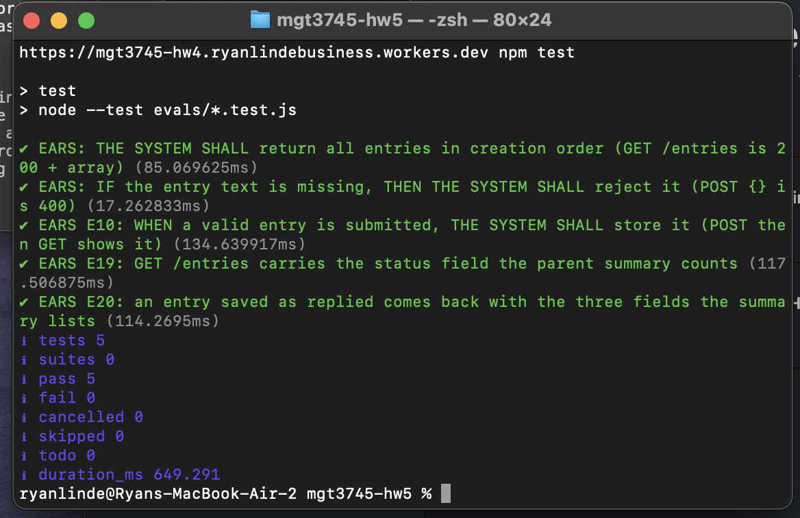
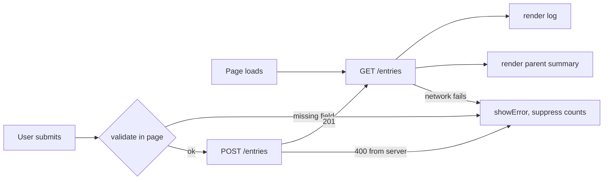

# Coach Contact Log: The First Delegated Feature


## Submission links

| | |
|---|---|
| **Deployed Worker** | <https://mgt3745-hw4.ryanlindebusiness.workers.dev/entries> |
| **This repository** | <https://github.com/ryanlinde-gif/mgt3745-hw5> |
| **HW4 repository** | <https://github.com/ryanlinde-gif/mgt3745-hw4> |

## What

The delegated feature is a **read-only parent summary** showing how many college
coaches have been contacted, how many have replied, and which ones — built by
bolt.new from my own context files, then read, integrated, and verified by me.

The problem is in [PROJECT.md](context/PROJECT.md); the version that matters is
narrower. [USERS.md](context/USERS.md) records a mother who defines "going well"
as *coaches responding, watching, asking for schedules*, and who declined an ID
camp because she could not tell whether the program was interested. She is
evidence-blocked, not price-blocked. The summary is that evidence, and it exists
now only because [ADR-002](context/ARCHITECTURE.md) moved the data out of the
athlete's browser onto a server — a parent cannot see a log that lives in
someone else's localStorage. The specification and the five acceptance rows this
feature was built against, E19 through E23, are in
[FEATURES.md](context/FEATURES.md).

## See It Work


This is **E19** and **E20** together: the count, and the named list of coaches
who replied. Two things worth noticing. The summary contains no buttons, which is
**E22** — the athlete in `USERS.md` insists on seeing every coach contacted on her
behalf, so a parent-facing control that could delete an entry would break that
without her knowing. And the counts come from the same `GET /entries` the log
above uses; there is no second source of truth.

The five tests, run against the deployed Worker:

```bash
API=https://mgt3745-hw4.ryanlindebusiness.workers.dev npm test
```





## How to Run

**Deployed:** <https://mgt3745-hw4.ryanlindebusiness.workers.dev/entries> — returns
the stored entries as JSON, needs nothing installed.

**To run the page against it:** serve `index.html` over HTTP from an origin in the
`ALLOWED_ORIGINS` list at the top of `worker.js`. In a Codespace, right-click
`index.html` and choose **Open with Live Server**. Opening through `file://` will
not work; the Worker will refuse the request and both lists will stay empty.

**To run the code eval:**

```bash
npm install
API=https://mgt3745-hw4.ryanlindebusiness.workers.dev npm test
```

The `API` variable is required; the suite throws a readable error without it. The
tests write to the live database and delete their own rows in an `after` hook.

**To deploy your own copy:** see [docs/SESSION_B_COMMANDS.md](docs/SESSION_B_COMMANDS.md).
To run the Worker locally: `npm run dev` on port 8787 with a local D1 emulator.

## Status

**Delegated feature: 5 of 5 EARS rows passing.** My committed prediction, made
before bolt saw the spec, was 3 of 5.

| Row | Statement | Verdict | Checked by |
|---|---|---|---|
| E19 | Show coaches contacted and how many replied | **PASS** | test + judgment #1 |
| E20 | List each replied coach's name, school, contact date | **PASS** | test + judgment #2 |
| E21 | Empty state in words, not a summary of zeros | **PASS** | human (database emptied and restored) + judgment #3 |
| E22 | Read-only, no add/edit/delete control | **PASS** | human (DOM read) + judgment #4 |
| E23 | Server unreachable: say so, show no counts | **PASS** | human (`?failSave`) + judgment #5 |

Carried forward from HW4 and unchanged: E5, E10–E18 **PASS**; server-returns-500
**CANNOT TEST YET**; two clients on one table **DEFERRED (ADR-002)**.

**One row got worse this week.** The Worker has no authentication — anyone with
the URL can read, write, or delete every entry. HW4 recorded that as a known
**FAIL** affecting the athlete's own data. HW5 adds a view intended for a
*different person* on the same open endpoint, with no way to tell them apart.
Neither tool raised it. ADR-003 is owed before this holds a real athlete's
contacts.

Full verification table, error-analysis log, and the resolved prediction stake:
[EVALS.md](context/EVALS.md).

## Delegation

- **[DDR-001](docs/DDR-001.md)** — the parent summary, built by bolt.new. Net **+0.5 hours saved**, which is close to noise. The real return was finding `.bolt/prompt`, a hidden instruction file shipped inside the deliverable telling the tool to prefer Tailwind, React, and its own sense of beauty — a second set of instructions competing with my STANDARDS.md, which I did not see until I unzipped the output.
- **[DDR-002](docs/DDR-002.md)** — the D1 insert statement, written by GitHub Copilot in HW4 and written up properly now. Net **−0.15 hours, a loss**: verifying eight lines of SQL cost more than writing them would have. Recorded as a loss because it was one.
- **[Comparison note](docs/COMPARISON.md)** — the same prompt through Google AI Studio. Both tools found the marked rows, both built read-only, both suppressed counts on failure, and **neither asked who the parent is**, although my instruction line invited questions and my spec never says.
- **[Reading checklist](docs/CHECKLIST.md)** — the seven questions, both tools, binary answers.
- **[Judgment eval](docs/JUDGMENT.md)** — ten questions, two graders, 100% agreement on verdicts. The graders differed on *evidence*: the second named a colour the first had missed, which surfaced that STYLE.md had no error-colour token at all.
- **[delegated/bolt-001.zip](delegated/bolt-001.zip)** — bolt's first output, unmodified, so the diff between what it produced and what shipped is inspectable.

## Links

Reading order for a stranger: [PROJECT.md](context/PROJECT.md) →
[USERS.md](context/USERS.md) → [FEATURES.md](context/FEATURES.md) →
[ARCHITECTURE.md](context/ARCHITECTURE.md) → [STANDARDS.md](context/STANDARDS.md) →
[TOOLS.md](context/TOOLS.md) → [STYLE.md](context/STYLE.md) →
[EVALS.md](context/EVALS.md) → [SKILLS.md](context/SKILLS.md) →
[CLAUDE.md](context/CLAUDE.md)

`AGENTS.md` remains a preview until Module 6.

## AI Use

Every delegation this week has a Delegation Decision Record, linked above. Both
are honest about their own economics: one saved half an hour, the other lost a
quarter of one.

**A note on the order of work, because the timestamps are the evidence.** The RAT
statement and prediction stake in [EVALS.md](context/EVALS.md) were committed at
**17:36:16** on 2026-09-29. bolt's unmodified output was committed at
**17:44:06**, eight minutes later. The predictions were written before the tool
saw the spec and were never edited afterwards; resolutions were added underneath
them. I was not in the Session B class where this was meant to happen, so the
stake was written after class on the day of the build, honestly dated.

Claude (Opus 5, via Claude Code) assisted throughout this assignment: assembling
the prompt bundle, integrating bolt's output, writing the evals, and drafting
these documents. It is deliberately **not** a grader in
[JUDGMENT.md](docs/JUDGMENT.md) — a second column from the tool that did the work
is agreement with itself, not a second opinion. The second grader is Gemini, run
in a fresh session, with the prompt recorded in that file.

**Hours spent on this assignment: about 2.**
